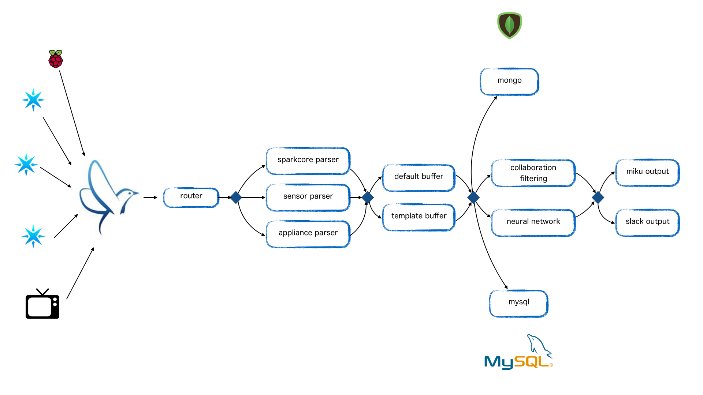

Room
===
リアルタイムマイニングシステム
宅内に配置されたセンサや家電の状態をリアルタイムに解析して家電操作のレコメンドを行う

## Architecture


## Data format
- postデータ
  - data-type: parserの選択
  - data: データ本体

```json
{
    "data-type": "sensor",
    "data": {
        temperature: ...
    }
}
```

## Requirement
- Python 3.4

## Install
- Pythonインストール
- pipインストール
- packageインストール
- git clone

## Setting
- supervisor.conf
- config.ini


## Usage
- 実行

```bash
./run.sh
```

